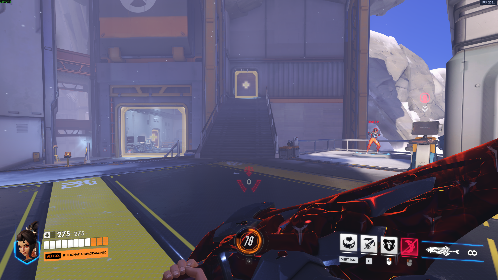
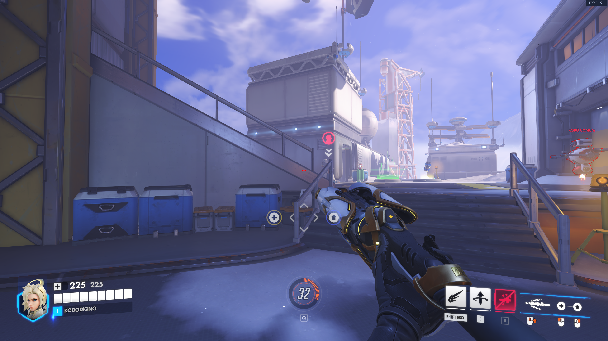
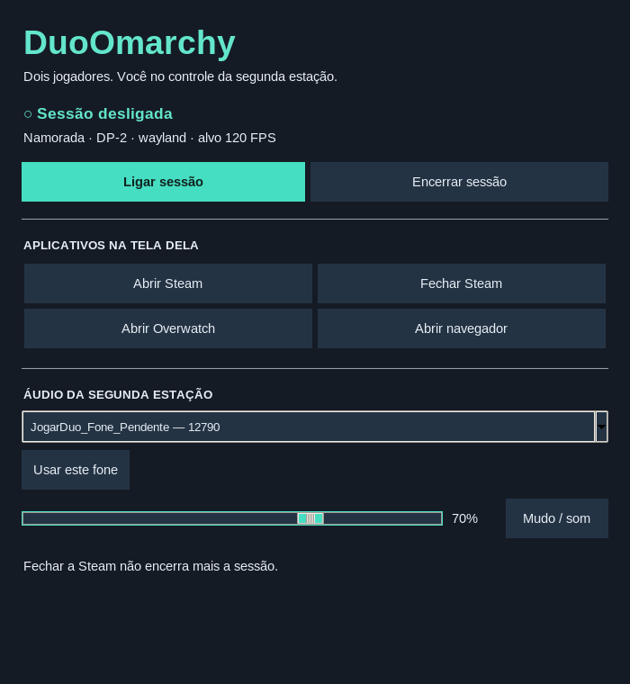

<div align="center">

# DuoOmarchy

### Um PC. Duas pessoas. Cada uma no seu jogo.

Duas contas Steam, dois kits de teclado e mouse, uma GPU compartilhada.<br>
Seu Omarchy continua seu. A segunda estação fica sob seu controle.

[Instalar](docs/INSTALL.md) · [Como funciona](docs/ARCHITECTURE.md) · [Resolver problemas](docs/TROUBLESHOOTING.md) · [Contribuir](CONTRIBUTING.md)


</div>

## Feito para jogar junto

O DuoOmarchy nasceu de uma vontade simples: jogar Overwatch com a namorada usando o mesmo computador, cada um com sua conta, monitor, teclado, mouse e fone.

O jogador principal fica na sessão normal do Omarchy, com **Super, atalhos e acesso aos outros monitores preservados**. O segundo kit controla uma sessão própria, com Steam e dados separados, renderizada pela mesma GPU.

Sem uma VM por jogador. Sem capturar o teclado principal. Sem encerrar a estação só porque a Steam foi fechada.

## Duas telas, duas contas — funcionando de verdade

| Sessão principal | Segunda estação |
| :---: | :---: |
|  |  |
| Omarchy normal; teclado principal livre. | Gamescope Wayland; teclado e mouse exclusivos. |

Capturas reais do campo de treinamento, autorizadas pelos jogadores. Os contadores mostram momentos isolados, **não um benchmark** nem uma garantia de FPS. O teste original usou Ryzen 7 9800X3D, RTX 4070 Ti SUPER e 64 GB de RAM, com dois jogos em 1440p. Após o ajuste para Wayland nativo e preparação de shaders, os jogadores confirmaram movimento fluido.

## Um gerenciador no seu desktop



Abra **DuoOmarchy — Gerenciador** no menu do Omarchy, ou execute:

```sh
duoomarchy manager
```

O painel permite ligar e encerrar a segunda estação, abrir e fechar a Steam, iniciar Overwatch, abrir um Chromium com perfil próprio. Saída de áudio, microfone, volume e mudo ficam no Sonora ou no mixer do sistema. O controle usa um socket local dentro da sessão; não precisa automatizar seu mouse, abrir portas de rede ou solicitar `sudo` a cada botão.

O segundo jogador não recebe outro Omarchy completo. A proposta é uma estação de aplicativos e jogos administrada pelo desktop principal. A interface de configuração dos kits fica em `duoomarchy configurar`.

## Ligar e jogar

Depois de [instalar e selecionar os kits](docs/INSTALL.md):

```sh
jogarduosim       # abre a segunda estação
jogarduonao       # fecha seus aplicativos e devolve o kit ao desktop
```

**Ctrl + Alt + F12 no teclado secundário** é a saída de emergência. O teclado principal permanece disponível para usar o terminal e desligar o modo normalmente. Sair do Overwatch volta à Steam; fechar a Steam mantém o serviço de controle disponível para reabri-la pelo gerenciador.

Entre na segunda conta Steam diretamente na janela secundária. A conta principal continua na Steam normal. **Não abra uma cópia isolada da conta principal**: isso pode substituir a sessão de autenticação e impedir o login no jogo.

## O que existe nesta primeira versão

- Captura seletiva e exclusiva do segundo teclado/mouse, incluindo interfaces auxiliares reconhecidas pelo libinput.
- Gamescope privado, compilado com um patch reproduzível; o Gamescope instalado pelo sistema não é substituído.
- Perfil Steam e ambientes de Proton separados; instalação opcional dos jogos por cópia Btrfs CoW.
- Backend Wayland nativo como padrão; SDL disponível para diagnóstico.
- Supervisão por systemd, saída de emergência e encerramento se um dispositivo capturado for removido.
- Gerenciador local e controle de aplicativos persistente, com protocolo de comandos restrito.
- Áudio compartilhado com o sistema, selecionado por aplicativo no Sonora, sem roteamento automático pelo DuoOmarchy.
- Ajustes de memória e de compilação de shaders para a sessão secundária.

## Antes de instalar

Esta é uma **versão experimental extraída de uma máquina real**, não uma distribuição multiseat pronta para qualquer PC. O fluxo de jogo foi validado na configuração acima. Instalação do zero, outras GPUs, outros jogos e headsets Bluetooth precisam de mais testes. O gerenciador tem testes automatizados e revisão visual; seus fluxos completos com todo hardware ainda estão em expansão.

Requer Omarchy com configuração Lua do Hyprland, Wayland, systemd de usuário, PipeWire/PulseAudio, Steam, dois kits e dois monitores. Há um build de Gamescope e uma configuração inicial dos dispositivos; **não é um instalador de um clique**.

As duas pessoas compartilham CPU, GPU e memória. Não há passthrough exclusivo de GPU, isolamento contra usuários maliciosos ou garantia de compatibilidade com anti-cheat. Consulte [limites e arquitetura](docs/ARCHITECTURE.md).

## Créditos

Criado por [LucasOl1337](https://github.com/LucasOl1337). Construído sobre Gamescope, Bubblewrap, Proton, DXVK, Omarchy, Hyprland, libinput, systemd e PipeWire. O patch de entrada parte do trabalho público do [Gamescope PR #1897](https://github.com/ValveSoftware/gamescope/pull/1897), com adaptações e correções documentadas.

Código de integração sob [MIT](LICENSE). Veja [THIRD_PARTY.md](THIRD_PARTY.md) para atribuição, licenças upstream e direitos sobre as capturas. Nenhum jogo, binário Steam, login ou credencial é distribuído.

---

**English:** DuoOmarchy runs a second independent Steam gaming station on the same Omarchy PC while preserving the primary user's desktop and keyboard shortcuts. It uses a patched Gamescope compositor, selective input capture, a private Steam home and a small management app on the main desktop. Experimental; tested on one AMD CPU / NVIDIA GPU setup. Portuguese documentation is the primary reference; contributions are welcome.
