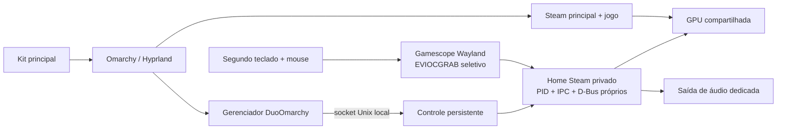

# Arquitetura

## Entrada

O gerenciador agrupa interfaces físicas pelo caminho USB, com validação de que os kits não se sobrepõem. O primeiro kit nunca é passado ao Gamescope. No segundo, teclas/mouse auxiliares reconhecidos por udev/libinput também são capturados. Interfaces como Wireless Radio Control, sem classificação de teclado/mouse, ficam de fora.

O patch usa `EVIOCGRAB` e falha se não conseguir exclusividade. Entrada SDL/Wayland herdada do compositor principal é desligada. Ctrl+Alt+F12 encerra o compositor secundário. Remover um dispositivo encerra a sessão para evitar uma estação sem controle. São caminhos de dispositivo, não portas USB de passthrough de uma VM.

## Steam

Bubblewrap monta um home privado sobre o home normal dentro do processo, separa PID/IPC, `/tmp`, `/dev/shm`, `/dev/input`, runtime e D-Bus. Compartilha GPU, binários do sistema e rede. PipeWire-Pulse é exposto pelo socket; o destino vem da configuração da sessão.

**Não é isolamento de segurança entre pessoas hostis.** O restante do filesystem é visível, o UID é o mesmo e há recursos do sistema compartilhados. O objetivo é separar perfis, instâncias e entrada. Não use o projeto para executar software não confiável contando com uma barreira de segurança.

Não se inicia um segundo cliente da conta principal. A conta secundária deve ser distinta; a Steam pode invalidar uma sessão quando o mesmo login é aberto em uma cópia concorrente.

## Controle persistente

`session-control.py` permanece vivo dentro do namespace, independentemente de a Steam estar aberta. Aceita apenas `ping`, `steam_open`, `steam_close`, `overwatch` e `browser_open`. O socket fica dentro do home 0700 e tem permissão restrita; o servidor verifica o UID do cliente por `SO_PEERCRED`. Não existe comando de shell arbitrário, servidor TCP ou automação global de mouse.

O Chromium secundário tem um diretório de perfil próprio. Não se conecta ao navegador principal, não ativa depuração e não usa flags para desabilitar a sandbox do navegador. Disponibilidade e compatibilidade do sandbox do Chromium dentro desse namespace ainda precisam de testes em mais instalações.

O painel gerencia áudio por PulseAudio. A sessão marca novos streams com `duoomarchy.session=player2`, e o supervisor encaminha esses streams para a saída selecionada. O volume altera a saída escolhida; por isso ela deve ser dedicada ao segundo jogador. O painel impede selecionar a saída configurada para o jogador principal.

## Apresentação e desempenho

O backend padrão é Wayland. No hardware inicial, SDL/X11 apresentava movimento irregular mesmo com contadores altos. A mudança para Wayland nativo, junto com o cache de shaders preparado e o limite do jogo, produziu a experiência que os jogadores aprovaram. Não fizemos um benchmark controlado que atribua toda a melhora a uma única variável.

Os jogos compartilham a GPU; um contador de 200 FPS não significa 200 quadros distintos exibidos no monitor. O modo não modifica os Hz físicos nem força VRR. `fps` define a frequência virtual e o wrapper de Overwatch aplica o alvo dentro do jogo.

A unidade secundária usa `MemoryLow=16G` e `MemorySwapMax=0`, com `MemoryLow=20G` na slice. Esses valores vieram de um PC de 64 GB e precisam ser revistos em máquinas menores. Proteção de memória não cria RAM nem garante ausência de OOM. Threads de compilação DXVK em segundo plano recebem nice 10; compilação requerida para o próximo quadro mantém prioridade normal. A prioridade do desktop principal não é reduzida.

## Estado da validação

- Duas contas no treino, kits independentes e Super principal preservado: confirmados pelos usuários.
- Movimento fluido na configuração Wayland: confirmado pelos usuários.
- Bluetooth secundário: adiado; não há validação de qualidade, microfone ou latência Bluetooth.
- Gerenciador: revisão visual, protocolo local e testes automatizados; teste integrado completo com Steam/navegador físico ainda pendente na primeira publicação após desconexão dos kits.
- Outros jogos, distribuições, GPUs e mais de duas pessoas: não validados.
