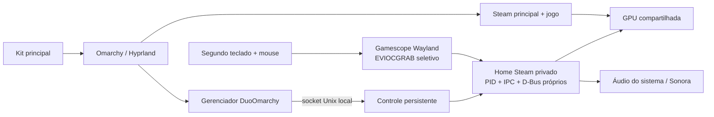

# Arquitetura

```mermaid
flowchart LR
  A[Kit principal] --> H[Omarchy / Hyprland]
  H --> P[Steam principal + jogo]
  H --> M[Gerenciador DuoOmarchy]
  B[Segundo teclado + mouse] --> G[Gamescope Wayland\nEVIOCGRAB seletivo]
  G --> S[Home Steam privado\nPID + IPC + D-Bus próprios]
  M -->|socket Unix local| C[Controle persistente]
  C --> S
  P --> GPU[GPU compartilhada]
  S --> GPU
  S --> F[Áudio do sistema / Sonora]
```

## Entrada

O gerenciador agrupa interfaces físicas pelo caminho USB, com validação de que os kits não se sobrepõem. O primeiro kit nunca é passado ao Gamescope. No segundo, interfaces auxiliares do teclado, mouse ou controle reconhecidas por udev/libinput também são capturadas. Interfaces sem classificação de entrada ficam de fora.

O patch usa `EVIOCGRAB` e falha se não conseguir exclusividade. Entrada SDL/Wayland herdada do compositor principal é desligada. Ctrl+Alt+F12 encerra o compositor secundário. Remover um dispositivo encerra a sessão para evitar uma estação sem controle. São caminhos de dispositivo, não portas USB de passthrough de uma VM.

Cada perfil registra o DPI físico atual e o DPI desejado. Na estação isolada, o Gamescope recebe a razão entre eles como multiplicador de movimento, em Jogo e Trabalho. Isso produz o DPI efetivo configurado sem gravar firmware. O perfil principal guarda o valor como referência e continua usando o DPI físico definido no próprio mouse ou no driver do fabricante.

## Steam

Bubblewrap monta um home privado sobre o home normal dentro do processo, separa PID/IPC, `/tmp`, `/dev/shm`, `/dev/input`, runtime e D-Bus. Compartilha GPU, binários do sistema e rede. PipeWire-Pulse é exposto pelo socket; o destino vem da configuração da sessão.

No modo `work`, o processo filho do Gamescope é um Hyprland aninhado. Para o compositor externo ele continua sendo uma única janela presa ao monitor e workspace configurados; internamente existem de 1 a 9 workspaces independentes. A home privada guarda configurações e perfis. O shell oficial do Omarchy recebe sua própria instância Quickshell e D-Bus. Os módulos padrão de atalhos, aparência, janela e tema são carregados; o autostart que importa ambiente para systemd é substituído por inicialização local. `uwsm-app` lança diretamente no namespace, e o launcher de navegador usa o ambiente privado, evitando mandar o app para o gerenciador da sessão principal. Arquivos comuns ficam montados em `~/Compartilhado`. Autenticação e configuração dos CLIs são compartilhadas conforme a política abaixo, enquanto históricos e processos permanecem privados. Uma ponte restrita expõe `agent-bench` para que automações visuais continuem nas bancadas externas 6–11.

O workspace externo pode ser persistente. Uma regra gerada o prende ao monitor selecionado e o supervisor reconcilia apenas a janela Gamescope da estação com `movetoworkspacesilent`. Ele também mantém tela cheia por um dispatcher endereçado à janela da estação, sem focar janela ou mover ponteiro. A barra externa fica coberta; o shell privado consulta somente os workspaces do compositor dela. Não move outras janelas nem troca o foco. A navegação solicitada pelo usuário fica separada em `duoomarchy enter`.

**Não é isolamento de segurança entre pessoas hostis.** O restante do filesystem é visível, o UID é o mesmo e há recursos do sistema compartilhados. O objetivo é separar perfis, instâncias e entrada. Não use o projeto para executar software não confiável contando com uma barreira de segurança.

Não se inicia um segundo cliente da conta principal. A conta secundária deve ser distinta; a Steam pode invalidar uma sessão quando o mesmo login é aberto em uma cópia concorrente.

## Controle persistente

`session-control.py` permanece vivo dentro do namespace, independentemente de a Steam estar aberta. Aceita apenas ações enumeradas de jogo ou trabalho, como `steam_open`, `overwatch`, `terminal`, `codex` e `claude`. A inicialização do shell corre em uma thread; o endpoint continua respondendo enquanto ele carrega. Uma conexão cujo cliente já fechou não derruba o serviço. O socket fica dentro do home 0700 e tem permissão restrita; o servidor verifica o UID do cliente por `SO_PEERCRED`. Não existe comando de shell arbitrário, servidor TCP ou automação global de mouse.

O Chromium secundário tem um diretório de perfil próprio. Não se conecta ao navegador principal, não ativa depuração e não usa flags para desabilitar a sandbox do navegador. Disponibilidade e compatibilidade do sandbox do Chromium dentro desse namespace ainda precisam de testes em mais instalações.

A sessão compartilha o servidor de áudio do desktop e marca seus streams com `duoomarchy.session=player2`. Quando `sink` ou `source` são escolhidos no configurador, a estação isolada recebe esses alvos por ambiente e aplica os níveis iniciais configurados; valores vazios herdam o mixer do desktop. Se o perfil principal selecionar dispositivos, eles viram os padrões do desktop durante a sessão e são restaurados ao encerrar, desde que o usuário não os tenha trocado depois. O DuoOmarchy não cria saídas virtuais nem move streams em segundo plano, e o Sonora continua disponível para ajustes ao vivo.

## Apresentação e desempenho

O backend padrão é Wayland. No hardware inicial, SDL/X11 apresentava movimento irregular mesmo com contadores altos. A mudança para Wayland nativo, junto com o cache de shaders preparado e o limite do jogo, produziu a experiência que os jogadores aprovaram. Não fizemos um benchmark controlado que atribua toda a melhora a uma única variável.

Os jogos compartilham a GPU; um contador de 200 FPS não significa 200 quadros distintos exibidos no monitor. O modo não modifica os Hz físicos nem força VRR. `fps` define a frequência virtual e o wrapper de Overwatch aplica o alvo dentro do jogo.

A unidade secundária usa `MemoryLow=16G` e `MemorySwapMax=0`, com `MemoryLow=20G` na slice. Esses valores vieram de um PC de 64 GB e precisam ser revistos em máquinas menores. Proteção de memória não cria RAM nem garante ausência de OOM. Threads de compilação DXVK em segundo plano recebem nice 10; compilação requerida para o próximo quadro mantém prioridade normal. A prioridade do desktop principal não é reduzida.

## Estado da validação

- Duas contas no treino, kits independentes e Super principal preservado: confirmados pelos usuários.
- Movimento fluido na configuração Wayland: confirmado pelos usuários.
- Bluetooth secundário: adiado; não há validação de qualidade, microfone ou latência Bluetooth.
- Gerenciador: revisão visual, protocolo local e testes automatizados; teste integrado completo com Steam/navegador físico ainda pendente na primeira publicação após desconexão dos kits.
- Trabalho: shell oficial, wallpaper, menus, 228 atalhos carregados, terminal, navegador, arquivos e workspace 9 validados na bancada em 04/10/2026. Inicialização física no Samsung com G515/AJAZZ verificada por estado, tela cheia 1920×1080, nove workspaces privados, 228 atalhos e captura exclusiva dos dispositivos; conforto dos kits é teste humano.
- Outros jogos, distribuições, GPUs e mais de duas pessoas: não validados.

### Rede compartilhada

O namespace de rede é preservado. O runtime privado monta somente para leitura o diretório do resolver real de `/etc/resolv.conf` e o socket de D-Bus de sistema, permitindo DNS, HTTPS e estado de rede sem compartilhar o D-Bus da sessão de desktop. Os harnesses reutilizam os binários instalados e as configs do PC: Codex, Claude Code, Grok, Hermes, Pi, Oh My Pi, OpenCode, Cursor Agent, Devin, jcode e Antigravity, quando presentes. Os wrappers da estação liberam as permissões de execução nos comandos que oferecem esse modo. Pi e jcode mantêm seu modelo nativo e as configurações existentes. Históricos, bancos de sessão e processos continuam na home privada. Os arquivos de configuração e autenticação são montados somente para leitura; o banco de autenticação do Oh My Pi recebe uma cópia inicial privada, porque precisa aceitar escritas do SQLite.

As skills do hub `~/.agents/skills` entram na estação como links em `~/.claude/skills`, `~/.grok/skills` e `~/.codex/skills`. A pasta `synced` de cada conta fica de fora. `~/Projects` e `~/Documents` apontam para os clones do PC pela home montada em `~/Compartilhado`.

### Maestri independente

O código de `~/.local/opt/maestri` é montado somente para leitura. O app usa `MAESTRI_DATA_DIR=~/.maestri` na home privada e `--user-data-dir=~/.config/duoomarchy-maestri`, com Xwayland próprio para evitar incompatibilidade de buffers do Electron com o compositor aninhado. Variáveis de identidade Maestri e jcode herdadas são removidas antes da partida da estação. O perfil inicial preserva presets e aparência, mas desliga SSH/remote companion e usa a porta 7434. Nenhum canvas ou socket do app principal é montado. A licença recebe uma cópia inicial privada para permitir renovação de seu cache sem escrever na instância principal. O Hermes compartilha também o diretório de dependências instaladas, incluindo os locks e leases que impedem descarte de bibliotecas em uso.
